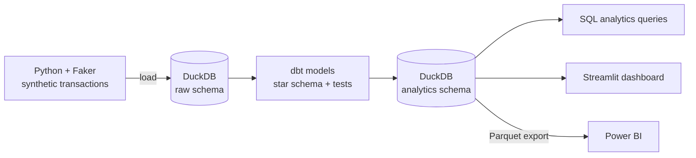

# E-commerce Data Warehouse · Python, DuckDB, dbt, Streamlit, Power BI

An end-to-end analytics data warehouse built from scratch for a simulated e-commerce business. It covers the full path a data engineer owns: generating and loading raw data, modeling it into a **star schema** with **dbt**, testing data quality automatically, and serving the results to a **Streamlit** dashboard and **Power BI**.

**Stack:** Python (pandas, Faker) · DuckDB · dbt · SQL · Streamlit · Power BI · Parquet

## Architecture



1. **Extract & Load:** Python scripts using `pandas` and `Faker` generate realistic transactional data and load it into a `raw` schema in DuckDB.
2. **Transform & Data Quality:** dbt cleans the raw data, models it into a star schema, computes business metrics (such as total sale value) and runs automated tests so no fact or dimension has null or duplicate IDs.
3. **Storage:** DuckDB, an embedded, high-performance OLAP engine, serves as the warehouse.
4. **Analysis:** ready-to-run SQL queries answer high-level business questions.
5. **Visualization:** an interactive dashboard written entirely in Python (Streamlit), plus a Parquet export ready for Power BI.

## Dimensional model

One fact table of sales surrounded by four dimensions. Column names in the code are in Portuguese; English meanings are shown in parentheses.

| Table | Columns |
| --- | --- |
| `fato_vendas` (sales fact) | `id_venda` PK, `id_cliente` FK, `id_produto` FK, `id_loja` FK, `data_venda` FK, `quantidade` (quantity), `valor_unitario` (unit price), `valor_total` (quantity × unit price) |
| `dim_cliente` (customer) | `id_cliente` PK, `nome`, `email`, `cidade`, `estado` |
| `dim_produto` (product) | `id_produto` PK, `nome_produto`, `categoria`, `preco` |
| `dim_loja` (store) | `id_loja` PK, `nome_loja`, `cidade`, `estado` |
| `dim_tempo` (date) | `data` PK, `dia`, `mes`, `ano`, `trimestre` (quarter), `dia_da_semana` (weekday) |

## How to run

**1. Set up the environment** (a virtual environment keeps the `dbt` command working):

```bash
python -m venv venv
source venv/bin/activate        # Windows: .\venv\Scripts\activate
pip install -r requirements.txt
```

**2. Run the whole pipeline** (generates data, builds the warehouse and runs the queries):

```bash
python run_pipeline.py
```

**3. Open the dashboard:**

```bash
streamlit run dashboard.py
```

## Power BI

- **Parquet (recommended):** in Power BI Desktop choose *Get Data → Parquet* and paste the local path of each file in `powerbi_data/` (the pipeline prints the exact paths). Then relate the fact table IDs to each dimension in *Model view* to rebuild the star schema. Parquet keeps data types intact and avoids locale issues with numbers.
- **DuckDB ODBC (advanced):** install the [DuckDB ODBC driver](https://duckdb.org/docs/api/odbc/overview), create a DSN pointing to `ecommerce.db`, and connect via *Get Data → ODBC*.

## What this project demonstrates

- Dimensional modeling (Kimball-style star schema)
- ELT with dbt, including automated data-quality tests
- Working with an OLAP engine (DuckDB) and columnar formats (Parquet)
- Delivering the same model to both code-based (Streamlit) and BI (Power BI) consumers

---

**Author:** Heberson Vinhote · Junior Data Engineer & Data Analyst · [LinkedIn](https://www.linkedin.com/in/heberson-vinhote-a7b1bb153)
